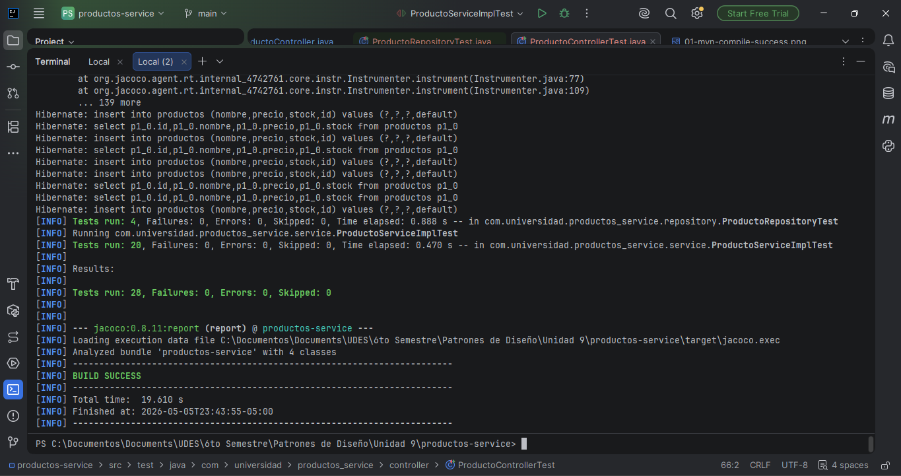
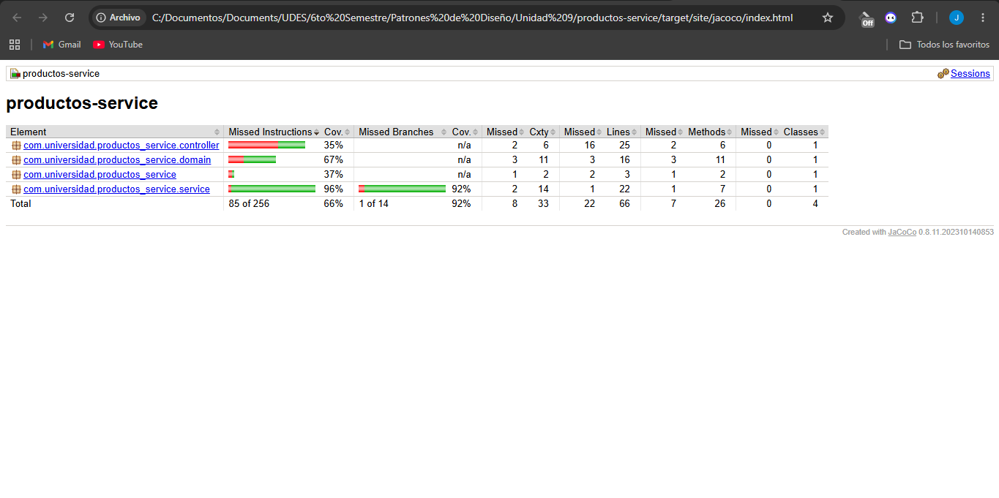
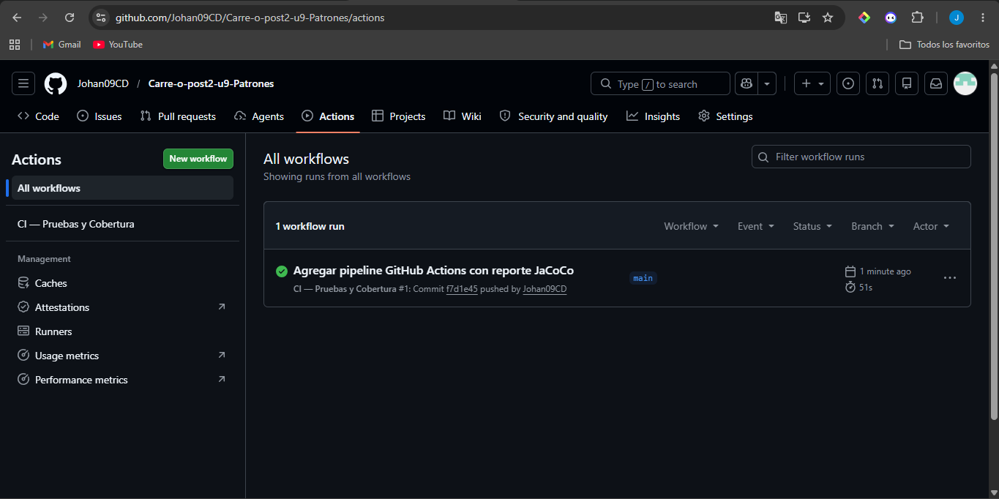

# productos-service — Post-Contenido 2, Unidad 9
Patrones de Diseño de Software  
Ingeniería de Sistemas — Universidad de Santander (UDES) — 2026  
Estudiante: Johan Carreño

---

## Descripción del Proyecto
Microservicio de gestión de productos desarrollado con Spring Boot 3.3, que amplía
el Post-Contenido 1 agregando pruebas de integración para la capa de persistencia
(@DataJpaTest) y la capa web (@WebMvcTest). Adicionalmente, se configura un pipeline
de integración continua con GitHub Actions que ejecuta automáticamente las pruebas
y genera un reporte de cobertura con JaCoCo en cada push al repositorio.

---

## Tecnologías utilizadas
- Java 21
- Spring Boot 3.3.5
- Spring Data JPA
- H2 Database (en memoria, scope test)
- JUnit 5 (vía Spring Boot Starter Test)
- Mockito 5
- JaCoCo (reporte de cobertura)
- GitHub Actions (CI/CD)
- Maven

---

## Instrucciones de Ejecución

### Prerrequisitos
- JDK 21 instalado y en el PATH
- Maven 3.9+
- Git

### 1. Clonar el repositorio
```bash
git clone https://github.com/Johan09CD/Carre-o-post2-u9-Patrones
```

### 2. Compilar el proyecto
```bash
mvn compile
```

### 3. Ejecutar todas las pruebas
```bash
mvn test
```

### 4. Generar reporte de cobertura JaCoCo
```bash
mvn verify
```
Abre en el navegador: `target/site/jacoco/index.html`

### 5. Ejecutar la aplicación
```bash
mvn spring-boot:run
```
La aplicación estará disponible en: http://localhost:8080

---

## Endpoints disponibles

| Método | URL | Descripción |
|--------|-----|-------------|
| GET | /api/productos | Listar todos los productos |
| POST | /api/productos?nombre=X&precio=Y&stock=Z | Crear producto |
| GET | /api/productos/{id} | Buscar por ID |
| PUT | /api/productos/{id}/stock?nuevoStock=N | Actualizar stock |
| DELETE | /api/productos/{id} | Eliminar producto |

---

## Descripción de las Pruebas

### Pruebas de Integración — Repositorio (@DataJpaTest)
La suite `ProductoRepositoryTest` verifica los métodos JPA contra H2 en memoria:

| Prueba | Descripción |
|--------|-------------|
| save_asignaIdAutomaticamente | Verifica que al guardar se asigna un ID válido |
| findById_existente_retornaProducto | Verifica retorno del producto cuando el ID existe |
| findAll_retornaListaCompleta | Verifica que se retornan todos los productos guardados |
| deleteById_eliminaProducto | Verifica que el producto es eliminado correctamente |

### Pruebas de Integración — Controlador (@WebMvcTest)
La suite `ProductoControllerTest` verifica la capa web con MockMvc:

| Prueba | Descripción |
|--------|-------------|
| listarProductos_retorna200ConLista | Verifica respuesta 200 con lista de productos |
| crearProducto_datosValidos_retorna201 | Verifica respuesta 201 al crear un producto válido |
| buscarProducto_noExistente_retorna404 | Verifica respuesta 404 cuando el producto no existe |

### Pruebas Unitarias — Servicio (Post-Contenido 1)
La suite `ProductoServiceImplTest` cubre 20 escenarios incluyendo happy path,
casos de error, pruebas parametrizadas y verificación con ArgumentCaptor.

---

## Evidencia de Pruebas en Verde

### Resultado de mvn test (28 pruebas)


### Reporte de cobertura JaCoCo


### Pipeline GitHub Actions ens verde


---

## Conceptos Aplicados

- **@DataJpaTest**: Pruebas de integración de la capa de persistencia con H2 en memoria,
  revirtiendo cada prueba en una transacción para garantizar aislamiento
- **@WebMvcTest**: Pruebas de la capa web cargando únicamente el contexto MVC,
  usando MockMvc para simular peticiones HTTP
- **@MockBean**: Sustitución del servicio real por un mock en las pruebas del controlador
- **GitHub Actions**: Pipeline de CI que ejecuta las pruebas automáticamente en cada
  push y sube el reporte JaCoCo como artefacto descargable
- **JaCoCo**: Herramienta de medición de cobertura de código integrada como plugin Maven